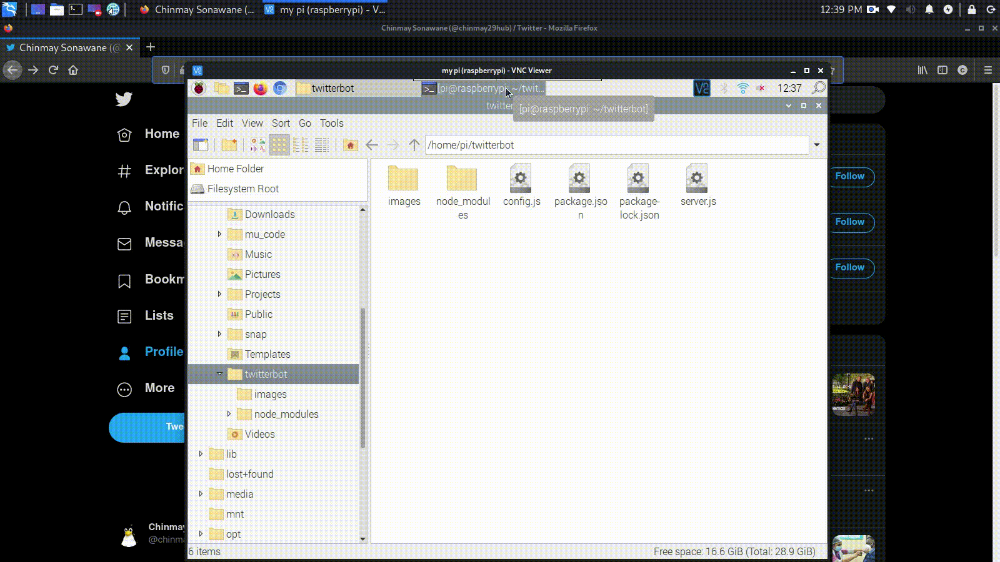

# twitter-bot

### Installation :
        
        1) npm init
        
        
        2) npm install twit --save
        
        
       
       
      
###### please replace the keys in config.js with your keys

#### Run : 

        node server.js
        
        
        
        
#### Sample Output : 

   
